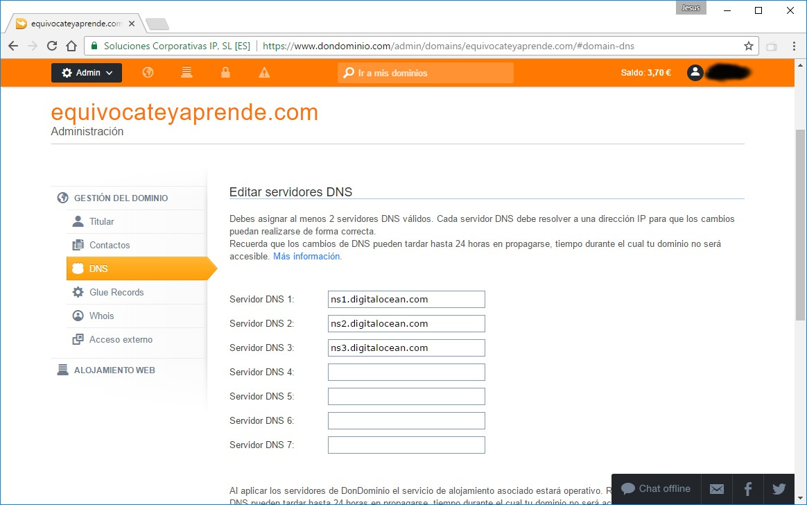

# Práctica proyecto final: Nueva funcionalidad para el paquete npm
## Paquete: gitbook-start-digitalocean-merquililycony


# Objetivo:
*El objetivo de esta práctica es extender el package NodeJS publicado en npm en una práctica anterior con una nueva*
*funcionalidad que permita que los usuarios realizar un despliegue automático en el servidor de Digital Ocean*

**NOTA: Si ya tienes una máquina en Digital Ocean con NODE y NPM instalados, puedes ir al PASO 5 directamente.**
# Paso 1: Creando una cuenta en Digital Ocean

Accedemos a [https://www.digitalocean.com/](https://www.digitalocean.com/) y nos creamos una cuenta. Una vez dentro hacemos click en **DROPLETS** para crear la configuración de la máquina.
Elegimos una distribución de linux, en este caso se ha utilizado UBUNTU, a continuación elegimos la ubicación de nuestro servidor (entre más cerca de donde se encuentre nuestro público objetivo mejor) y hacemos clic en crear nuestra máquina.


# Paso 2: Vinculando un nombre de dominio a nuestra máquina de Digital Ocean

**Este paso es opcional** así que si no deseas hacerlo ve directo al **Paso 3**.
Se vinculará un nombre de dominio a la IP de la máquina que acabamos de crear en Digital Ocean, de esta forma podemos acceder al libro tecleando el nombre del dominio, pero si deseas puedes acceder con tu dirección IP pública.

Para esto, dentro de nuestra cuenta de Digital Ocean vamos a **Droplets, More, add a domain** y escribimos el nombre del dominio que deseamos vincular.


 Una vez añadido copiamos los NS, vamos al sitio web donde tenemos registrado nuestro dominio y lo pegamos en la **zona de DNS**, en mi caso he utilizado **dondominio.com**. Debes tener en cuenta que este proceso puede tardar hasta 24 horas ya que las DNS deben propagarse por los diversos servidores en todo el mundo.



Existen diversos portales en Internet como [https://www.whatsmydns.net/](https://www.whatsmydns.net/)  donde puedes verificar el estado de las DNS.


# Paso 3: Acceso SSH a Digital Ocean

Al crear la configuración de nuestra máquina recibiremos un email con los datos de acceso.
Abrimos una consola y ejecutamos **shh root@IP** , en nuestro caso sería:


```bash
ssh root@178.62.123.244
```

Introducimos la contraseña que nos ha llegado al email, la confirmamos y luego nos pedirá nuestra nueva contraseña.
El siguiente paso es configurar una clave ssh para poder acceder automáticamente a nuestro servidor sin loguearnos. 

**NOTA IMPORTANTE:** Para que la clave funcione correctamente en el servidor remoto, **~/.ssh/authorized_keys** debe tener unos permisos concretos, así que dentro de nuestro servidor remoto tecleamos:


```bash
chmod 0700 $HOME/.ssh/
chmod 0600 $HOME/.ssh/authorized_keys
exit
```

Ahora vamos a nuestro servidor local al directorio **~/.ssh** y en caso de no tener ninguna clave ejecutamos el siguiente comando:


```bash
ssh-keygen -t rsa
```

Lo siguiente es copiar la información de nuestra clave pública de la máquina local a nuestro servidor remoto, en este ejemplo copiaremos la información de **id_dsa.pub** que se encuentra en la máquina local al fichero **~/.ssh/authorized_keys** de la máquina remota. Esto lo podemos hacer con **ssh-copy-id -i ~/.ssh/clave_rsa.pub usuario@IP** donde usuario e IP son los datos de la máquina remota.

```bash
ssh-copy-id -i ~/.ssh/id_rsa.pub root@178.62.123.244
```

# Paso 4: Preparando la máquina remota para correr un servidor Express

Instalamos **NODEJS** y **NPM** en nuestro servidor remoto

```bash
curl -sL https://deb.nodesource.com/setup_6.x | sudo -E bash -
sudo apt-get install -y nodejs
sudo apt-get install -y build-essential
```

# Paso 5: Crear y desplegar el libro.

```bash
npm install -g nueva-funcionalidad-para-el-paquete-npm-merquililycony
gitbook-start -d <directorio>
cd <directorio>
npm install
npm install --save gitbook-start-digitalocean-merquililycony
gulp deploy
gulp deploy-digitalocean
```
Con esto ya podemos acceder a nuestro libro escribiendo la dirección IP de nuestra máquina en Digital Ocean ó el nombre de dominio en caso de haber realizado el Paso 2.

[http://178.62.30.50:8080](http://178.62.123.244:8080)

[https://equivocateyaprende.com](https://equivocateyaprende.com)

## Enlaces :

 **Enlace al campus virtual**

 * [Enunciado](https://casianorodriguezleon.gitbooks.io/ull-esit-1617/content/proyectos/sytw/)

 **Repositorio GitHuB donde se realizó la práctica**
 * [Repo nueva funcionalidad](https://github.com/ULL-ESIT-SYTW-1617/proyecto-sytw-16-17-merquililycony)
 * [Repo paquete](https://github.com/ULL-ESIT-SYTW-1617/gitbook-start-digitalocean-merquililycony/)
 * [Organización](https://github.com/ULL-ESIT-SYTW-1617/gitbook-start-digitalocean-merquililycony/)
 * [npm](https://www.npmjs.com/package/gitbook-start-digitalocean-merquililycony)

 **Página de los autores**

 * [Constanza](http://alu0100673647.github.io)
 * [Merquis](http://merquis.github.io)
 * [Liliana](https://alu0100762846.github.io)
